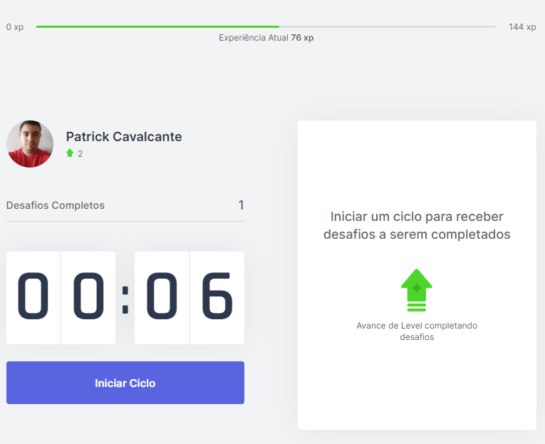

## Começando

Primeiro, execute o servidor de desenvolvimento:

`` `bash
npm install
npm run dev
# ou
yarn install
yarn dev
`` `

Abra [http: // localhost: 3000] (http: // localhost: 3000) com seu navegador para ver o resultado.

Você pode começar a editar a página modificando `pages / index.tsx`. A página é atualizada automaticamente conforme você edita o arquivo.

## Saber mais e Screen

